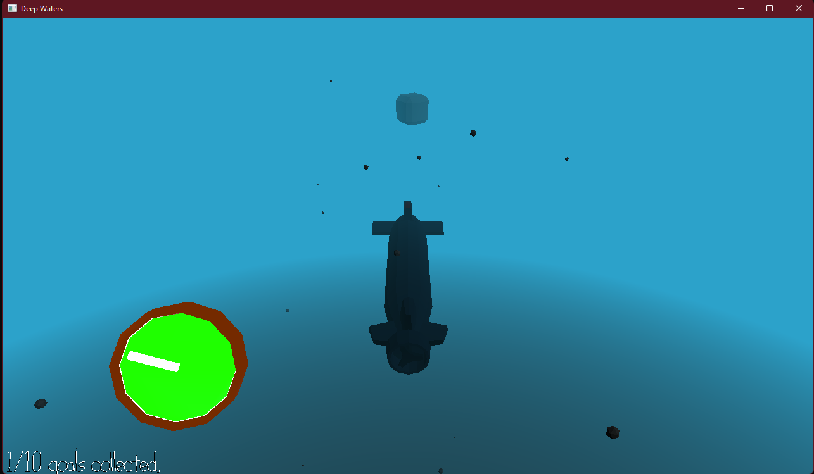

# Deep Waters

Author: Thomas Carey

Design: Sonar tells you the location of goals, as they are obscured by the fog of the ocean.

Screen Shot:

How To Play:

A/D to turn the sub. W/S to move forward and backward. Q/E to rise and fall.
Listen to the sonar blips to find the direction of the goals and run into them to pick them up.

This game was built with [NEST](NEST.md).
